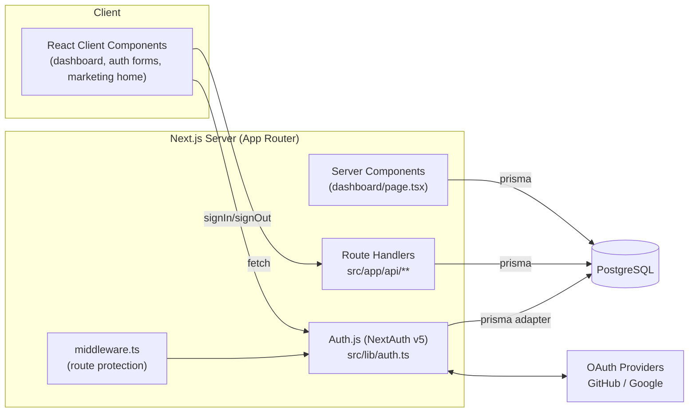

# Architecture

## Overview

KlipBoard is a full-stack Next.js 15 (App Router) application backed by PostgreSQL.
It lets a user sign in and maintain "notepads" (text or code) that sync
across every device they log into. There is no client-side storage of
record - Postgres via Prisma is the single source of truth, read/written
through Next.js Route Handlers.

## Layers

| Layer | Location | Responsibility |
|---|---|---|
| Presentation | `src/app/**/page.tsx`, `*-client.tsx` | Rendering, forms, notepad editor UI |
| Route protection | `src/middleware.ts` | Redirects unauthenticated requests away from `/dashboard`; redirects already-authenticated requests away from `/login`/`/signup` |
| Design system | `src/app/globals.css`, `src/components/ui/**`, `src/components/motion/**`, `src/components/three/**` | Soft Tactile / Dark Neumorphism tokens, shared `Panel`/`Button` primitives, GSAP + Framer motion, generative Three.js background |
| Auth | `src/lib/auth.ts`, `src/app/api/auth/**` | Credentials + OAuth sign-in, JWT session, signup |
| API | `src/app/api/notepads/**` | Notepad CRUD, authorization (owner-only) |
| Data access | `src/lib/prisma.ts` | Singleton Prisma client |
| Data model | `prisma/schema.prisma` | User, Account, Session, VerificationToken, Notepad |

## Request flow - loading the dashboard

1. Browser requests `/dashboard`.
2. `src/middleware.ts` checks the Auth.js session; unauthenticated requests
   are redirected to `/login?callbackUrl=/dashboard`.
3. `src/app/dashboard/page.tsx` (Server Component) calls `auth()` again for
   the session, then queries `prisma.notepad.findMany` scoped to
   `session.user.id`.
4. Notepads are serialized (dates → ISO strings) and passed as props to the
   Client Component `dashboard-client.tsx`, which owns all further
   create/save/rename/delete interaction via `fetch` calls to
   `/api/notepads`.

## Request flow - editing a notepad

1. Client edits text in a `<textarea>`; content is held in local React state
   (`draftContent`). A debounced autosave (1.2s idle) calls `PUT
   /api/notepads/[id]` automatically; a manual "Save" button (or
   Cmd/Ctrl+S) triggers an immediate save with toast/sound/haptic
   feedback. (Supersedes the earlier no-autosave decision - see
   `docs/memorybank.md`.)
2. `PUT /api/notepads/[id]` is called with the updated `content`/`title`/
   `tags`/`color`. If offline, `public/sw.js` queues the request in
   IndexedDB and returns a synthetic `202` instead of failing.
3. The handler re-authenticates via `auth()`, verifies the notepad's
   `userId` matches the session user (ownership check - no other user's
   notepad is ever exposed), rate-limits (60 writes/min/user), validates
   the payload with `zod`, and updates the row via Prisma.
4. The updated notepad is returned and merged back into client state.

## Authentication

- **Session strategy:** JWT (not database sessions), configured in
  `src/lib/auth.ts`. The Prisma adapter is still used so OAuth
  accounts/verification tokens are persisted relationally.
- **Edge/Node split:** `src/middleware.ts` runs in the Edge runtime, which
  cannot load `@prisma/client`. It imports `src/lib/auth.edge.ts` (built
  from the Prisma/bcrypt-free `src/lib/auth.config.ts`) instead of the full
  `src/lib/auth.ts`, which is only imported from Route Handlers/Server
  Components (Node.js runtime).
- **Credentials provider:** email + password. Passwords are hashed with
  `bcryptjs` (cost factor 12) at signup (`/api/auth/signup`) and compared at
  login (`authorize()` in `src/lib/auth.ts`). Plaintext passwords are never
  stored or logged.
- **OAuth providers:** GitHub and Google, wired through the same
  `PrismaAdapter`, linked to the same `User` row via the `Account` table.
- **Authorization boundary:** every notepad API route re-derives the
  session server-side (`auth()`) and checks resource ownership before any
  read, write, or delete - client-supplied user IDs are never trusted.

## Data model (see `prisma/schema.prisma`)

- `User` - username/email/passwordHash (nullable for OAuth-only users),
  relations to `Account`, `Session`, `Notepad`.
- `Account` / `Session` / `VerificationToken` - standard Auth.js/Prisma
  adapter tables.
- `Notepad` - `title`, `content` (`Text`), `kind` (`TEXT` | `CODE`),
  optional `language`, `tags` (`String[]`, free-form), optional `color`
  (hex accent tint), `userId` foreign key, indexed on `userId`.

## Design system - Soft Tactile / Dark Neumorphism

The production UI (home, login, signup, dashboard) uses a single chosen
direction, selected from an earlier five-concept showcase (now removed).

- **Tokens** - `src/app/globals.css` defines the graphite/mint palette
  (`--bg`, `--surface`, `--surface-sunken`, `--fg`, `--muted`, `--accent`)
  and dual box-shadow raised/inset pairs (`--shadow-out`, `--shadow-out-lg`,
  `--shadow-in`) plus shared classes (`.neu-panel`, `.neu-panel--inset`,
  `.neu-btn`, `.neu-btn--primary`, `.neu-btn--ghost`, `.bg-fallback`).
- **Primitives** - `src/components/ui/Panel.tsx` and `Button.tsx` wrap
  these classes in Framer Motion components (`softSpring`/`gentleSpring`
  presets in `src/lib/motion.ts`) and are reused across every page instead
  of one-off inline styles.
- **Motion** - `src/lib/gsap.ts` registers `ScrollTrigger` once, client-side
  only; `src/hooks/useScrollReveal.ts`, `src/hooks/useStaggerReveal.ts`,
  and `src/components/motion/RevealText.tsx` provide reusable
  scroll/entrance/list-stagger animation; `src/components/motion/EmptyState.tsx`
  is a mount-triggered illustration for zero-notepad states. All no-op
  under `prefers-reduced-motion`.
- **Generative background** - `src/components/three/NeumorphicBackground.tsx`
  (R3F + custom GLSL noise shader + drei `Sparkles`) is always consumed via
  `src/components/three/BackgroundCanvas.tsx`, which lazy-loads it with
  `next/dynamic({ ssr: false })` and renders a static `.bg-fallback` div via
  `useSyncExternalStore` on `prefers-reduced-motion` or before hydration.
  Both accept an optional `activityRef` (from `src/hooks/useTypingActivity.ts`)
  that feeds a decaying `uActivity` shader uniform, so the noise field's
  mint highlight intensifies while the user is typing and settles back at
  idle - read per-frame in `useFrame`, never triggering a React re-render.
- **Toasts / command palette** - `src/components/ui/Toast.tsx` (save
  confirmation, checkmark-pulse via the `gentleSpring` preset) and
  `src/components/ui/CommandPalette.tsx` (Cmd/Ctrl+K quick-switch, with a
  hidden "party" query string that triggers a background-intensity burst)
  are dashboard-only, wired from `dashboard-client.tsx`.

## Environment

Configuration lives in `.env` (see `.env.example`) - `DATABASE_URL`,
`AUTH_SECRET`, `NEXTAUTH_URL`, OAuth client credentials,
`NEXT_PUBLIC_SITE_URL`, `SELF_URL`.

## SEO, PWA & keep-alive

- **SEO:** `src/app/layout.tsx` sets full metadata (Open Graph, Twitter
  card, robots, icons, `metadataBase`). `src/app/robots.ts` and
  `src/app/sitemap.ts` are Next.js file-convention routes generating
  `/robots.txt` and `/sitemap.xml`.
- **PWA:** `src/app/manifest.ts` generates `/manifest.webmanifest`
  (auto-linked by Next). `src/components/pwa/RegisterSW.tsx` registers
  `public/sw.js` (production only) - a minimal cache-first shell for
  static assets, network-first for everything else, and explicitly never
  caches `/api/**`.
- **Error/loading UX:** `src/app/not-found.tsx` (404),
  `src/app/error.tsx` (route-segment error boundary),
  `src/app/global-error.tsx` (root layout error boundary), and
  `src/app/loading.tsx` / `src/app/dashboard/loading.tsx` (Suspense
  fallbacks) reuse the `Panel`/`Button` primitives.
- **Free-tier keep-alive** (see `docs/DEPLOYMENT.md` for full detail):
  - `src/lib/prisma.ts` runs a 5-minute `SELECT 1` interval to stop Neon
    from suspending its compute.
  - `src/instrumentation.ts` (Next.js `register()` hook) starts a
    10-minute self-ping against `GET /api/health` in production, using
    Render's `RENDER_EXTERNAL_URL`, to stop the Render instance itself
    from spinning down. `/api/health` has no auth/DB dependency.

## Cross-cutting conventions

- **Validation:** all API route bodies are validated with `zod` before
  touching Prisma.
- **Ownership checks:** implemented per-route in `src/app/api/notepads/[id]/route.ts`
  (`getOwnedNotepad`) rather than in middleware, since it requires a DB read.
- **Rate limiting:** `src/lib/rateLimit.ts` is an in-memory fixed-window
  limiter, applied to `/api/auth/signup` (5/10min/IP) and all notepad
  mutations (60/min/user). Per-instance only - acceptable for KlipBoard's
  single free-tier Render instance; would need a shared store (Redis)
  before scaling horizontally.
- **Offline notepad saves:** `public/sw.js` intercepts `PUT
  /api/notepads/[id]` specifically (still never caches other `/api/**`
  routes), queues failed requests in IndexedDB, and replays them via
  Background Sync or the next successful save.